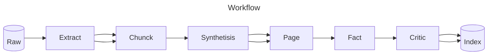
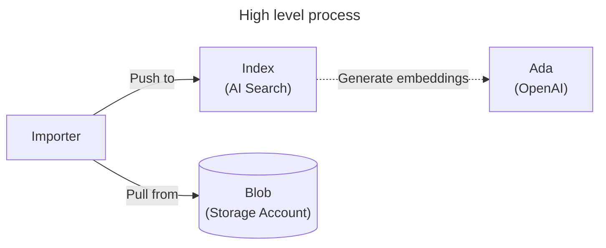
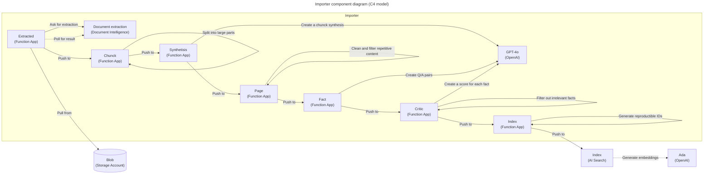

# 🧠 Synthetic RAG Index

Service to import data from various sources (e.g. PDF, images, Microsoft Office, HTML) and index it in AI Search. Increases data relevance and reduces final size by 95%+. Useful for RAG scenarios with LLM. Hosted in Azure with serverless architecture.

<!-- github.com badges -->
[](https://github.com/clemlesne/call-center-ai/releases)
[](https://github.com/clemlesne/call-center-ai/blob/main/LICENSE)

## Overview

It includes principles taken from research papers:

1. Repetition removal (https://arxiv.org/abs/2112.11446)
2. Corpus cleaning (https://arxiv.org/abs/1910.10683)
3. Synthetic data generation (https://huggingface.co/spaces/HuggingFaceFW/blogpost-fineweb-v1)



### Features

> [!NOTE]
> This project is a proof of concept. It is not intended to be used in production. This demonstrates how can be combined Azure serverless technologies and LLM to a high quality search engine for RAG scenarios.

- [x] Cost anything when not used thanks to serverless architecture
- [x] Data can be searched with semantic queries using AI Search
- [x] Deduplicate content
- [x] Extract text from PDF, images, Microsoft Office, HTML
- [x] Garbage data detection
- [x] Index files from more than 1000 pages
- [x] Remove redundant and irrelevant content by synthesis data generation

### Demo

As an example, we take the [Groupama-Resultats-offre-de-rachat-CP.pdf](examples/raw/Groupama-Resultats-offre-de-rachat-CP.pdf) file.

First, data is extracted from its binary format:

```json
{
  "format": "markdown",
  "langs": ["fr-FR"],
  "title": "COMMUNIQUÉ FINANCIER",
  "document_content": "COMMUNIQUÉ FINANCIER\n\n<figure>\n\n\n\n<!-- FigureContent=\"LE GROUPE Groupama\" -->\n\n</figure>\n\n\nLE PRÉSENT COMMUNIQUÉ NE DOIT PAS ÊTRE DIFFUSÉ AUX ÉTATS-UNIS\n\nParis, le 10 octobre 2022\n\nGroupama Assurances Mutuelles a racheté pour 228,9 millions d'euros les obligations senior subordonnées perpétuelles émises en 2014\n\nGroupama Assurance Mutuelles annonce les résultats de l'offre de rachat qui a expiré le 7 octobre 2022 sur les Obligations Senior Subordonnées Perpétuelles portant intérêt à taux fixe à puis à taux variable d'un montant de 1.100.000.000 d'euros (ISIN : FR0011896513) émises en 2014. Le montant final du rachat est de 228,9 millions d'euros.\n\nCette opération contribue à la gestion proactive de la structure de capital de Groupama.\n\n| Contact presse Safia Bouda | Contact analystes et investisseurs Valérie Buffard |\n| - | - |\n| + 33 (0)6 02 04 48 63 | +33 (0)6 70 04 12 38 |\n| safia.bouda@groupama.com | valerie.buffard@groupama.com |\n\n<!-- PageFooter=\"A propos du groupe Groupama\" -->\n\nDepuis plus de 100 ans, le Groupe Groupama, fonde son action sur des valeurs humanistes intemporelles pour permettre au plus grand nombre de construire leur vie en confiance. Le Groupe Groupama, l'un des premiers groupes d'assurance mutualistes en France, développe ses activités d'assurance, et de services dans dix pays. Le groupe compte 12 millions de sociétaires et clients et 31 000 collaborateurs à travers le monde, avec un chiffre d'affaires annuel de 15,5 milliards d'euros. Retrouvez toute l'actualité du Groupe Groupama sur son site internet (www.groupama.com)\n"
}
```

Second, document is paged, and each page is synthesized to keep track of the context during all steps:

```json
{
  "chunk_content": "[...]",
  "synthesis": "Groupama Assurances Mutuelles has repurchased perpetual subordinated senior bonds issued in 2014 for 228.9 million euros, contributing to the proactive management of its capital structure. This announcement made on October 10, 2022, follows the expiration of the repurchase offer on October 7, 2022. Groupama, a leading mutual insurance group in France with over a century of history, operates in ten countries, serving 12 million customers and employing 31,000 people, with an annual turnover of 15.5 billion euros.",
  [...]
}

```

Third, multiple facts (=Q&A pairs) are generated, and those are critiqued to keep only the most relevant ones:

```json
{
  "facts": [
    {
      "question": "What did Groupama Assurances Mutuelles announce regarding the bonds issued in 2014?",
      "answer": "Groupama Assurances Mutuelles announced the repurchase of perpetual subordinated senior bonds issued in 2014 for 228.9 million euros.",
      "context": "The bonds, initially issued in 2014 with a total amount of 1.1 billion euros and ISIN code FR0011896513, were repurchased as part of Groupama's proactive capital structure management. The announcement was made on October 10, 2022, after the repurchase offer expired on October 7, 2022."
    },
    {
      "question": "When did the repurchase offer for Groupama's bonds expire?",
      "answer": "The repurchase offer expired on October 7, 2022.",
      "context": "Groupama made the announcement on October 10, 2022, regarding the expiration of the offer and the final repurchase amount of 228.9 million euros for the bonds issued in 2014."
    }
  ],
  [...]
}

```

Finally, facts are individually indexed in AI Search:

```json
[
  {
    "answer": "Media can contact Safia Bouda at +33 (0)6 02 04 48 63 or via email at safia.bouda@groupama.com, and analysts can contact Valérie Buffard at +33 (0)6 70 04 12 38 or via email at valerie.buffard@groupama.com.",
    "context": "These contact details were provided in the official financial press release by Groupama for further inquiries.",
    "document_synthesis": "Groupama Assurances Mutuelles announced the repurchase of perpetual subordinated senior bonds worth 228.9 million euros, initially issued in 2014 with a total amount of 1.1 billion euros. This strategic financial maneuver aims to proactively manage the company's capital structure. The offer concluded on October 7, 2022. Groupama, a leading mutual insurance group in France, operates in ten countries with an annual revenue of 15.5 billion euros.",
    "id": "ee01a3099614ebeabd61f525b5bf0561af44a0fa37101ddbaf5e6c16bfc80564",
    "question": "How can media and analysts contact Groupama for more information?"
  },
  [...]
]
```

### High level architecture



### Component level architecture



## Local installation

### Prerequisites

Place a file called `config.yaml` in the root of the project with the following content:

```yaml
# config.yaml
llm:
  api_key: xxx
  context: 128000
  deployment: gpt-4o-2024-05-13
  endpoint: https://xxx.openai.azure.com
  model: gpt-4o

ai_search:
  access_key: xxx
  endpoint: https://xxx.search.windows.net
  index: trainings

document_intelligence:
  access_key: xxx
  endpoint: https://xxx.cognitiveservices.azure.com
```

To use a Service Principal to authenticate to Azure, you can also add the following in a `.env` file:

```dotenv
AZURE_CLIENT_ID=xxx
AZURE_CLIENT_SECRET=xxx
AZURE_TENANT_ID=xxx
```

To override a specific configuration value, you can also use environment variables. For example, to override the `llm.endpoint` value, you can use the `LLM__ENDPOINT` variable:

```dotenv
LLM__ENDPOINT=https://xxx.openai.azure.com
```

Then run:

```bash
# Install dependencies
make install
```

AI Search also requires to be configured with the following index:

| **Field Name** | `Type` | Retrievable | Searchable | Dimensions | Vectorizer |
|-|-|-|-|-|-|
| **answer** | `Edm.String` | Yes | Yes | | |
| **context** | `Edm.String` | Yes | Yes | | |
| **created_at** | `Edm.String` | Yes | No | | |
| **document_synthesis** | `Edm.String` | Yes | Yes | | |
| **file_path** | `Edm.String` | Yes | No | | |
| **id** | `Edm.String` | Yes | No | | |
| **question** | `Edm.String` | Yes | Yes | | |
| **vectors** | `Collection(Edm.Single)` | No | Yes | 1536 | *OpenAI ADA* |

### Run

Finally, run:

```bash
# Start the local API server
make dev
```
