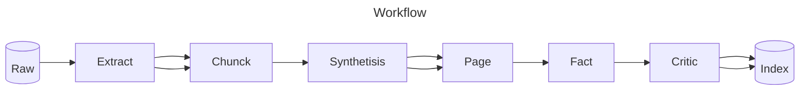
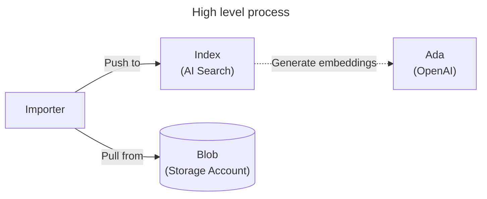
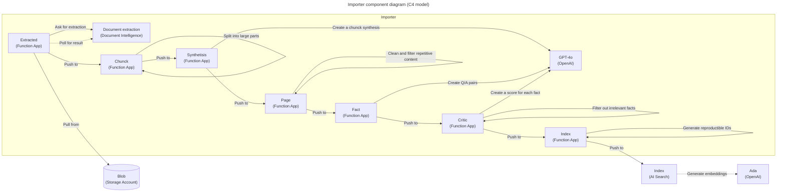

# 🧠 Synthetic RAG Index

Service to import data from various sources (e.g. PDF, images, Microsoft Office, HTML) and index it in AI Search. Increases data relevance and reduces final size by 90%+. Useful for RAG scenarios with LLM. Hosted in Azure with serverless architecture.

<!-- github.com badges -->
[](https://github.com/clemlesne/call-center-ai/releases)
[](https://github.com/clemlesne/call-center-ai/blob/main/LICENSE)

## Overview

In a real-world scenario, with a public corpus of 15M characters (222 PDF, 7.330 pages), 2.940 facts were generated (8.41 MB indexed). That's a 93% reduction in document amount compared to the chunck method (48.111 chuncks, 300 characters each).

It includes principles taken from research papers:

1. Repetition removal (https://arxiv.org/abs/2112.11446)
2. Corpus cleaning (https://arxiv.org/abs/1910.10683)
3. Synthetic data generation (https://huggingface.co/spaces/HuggingFaceFW/blogpost-fineweb-v1)

Funcional workflow is as follows:



### Features

> [!NOTE]
> This project is a proof of concept. It is not intended to be used in production. This demonstrates how can be combined Azure serverless technologies and LLM to a high quality search engine for RAG scenarios.

- [x] Cost anything when not used thanks to serverless architecture
- [x] Data can be searched with semantic queries using AI Search
- [x] Deduplicate content
- [x] Extract text from PDF, images, Microsoft Office, HTML
- [x] Garbage data detection
- [x] Index files from more than 1000 pages
- [x] Remove redundant and irrelevant content by synthesis data generation

### Format support

Document extraction is based on Azure Document Intelligence, specifically on the `prebuilt-layout` model. It [supports the following](https://learn.microsoft.com/en-us/azure/ai-services/document-intelligence/concept-layout?view=doc-intel-4.0.0&tabs=sample-code#input-requirements) formats:

- HTML
- Images: JPEG/JPG, PNG, BMP, TIFF, HEIF
- Microsoft Office: Word (DOCX), Excel (XLSX), PowerPoint (PPTX)
- PDF

### Demo

As an example, we take the [code_des_assurances_2024_1.pdf](examples/raw/code_des_assurances_2024_1.pdf) file.

First, data is extracted from its binary format:

```json
{
  "created_at": "2024-06-08T19:17:51.229972Z",
  "document_content": "Code des assurances\n===\n\ndroit. org Institut Français d'Information Juridique\n\nDernière modification: 2024-01-01 Edition : 2024-01-19 2347 articles avec 5806 liens 57 références externes\n\nCe code ne contient que du droit positif français, les articles et éléments abrogés ne sont pas inclus. Il est recalculé au fur et à mesure des mises à jour. Pensez à actualiser votre copie régulièrement à partir de codes.droit.org.\n\nCes codes ont pour objectif de démontrer l'utilité de l'ouverture des données publiques juridiques tant législatives que jurisprudentielles. Il s'y ajoute une promotion du mouvement Open Science Juridique avec une incitation au dépôt du texte intégral en accès ouvert des articles de doctrine venant du monde professionnel (Grande Bibliothèque du Droit) et universitaire (HAL-CNRS).\n\nTraitements effectués à partir des données issues des APIs Legifrance et Judilibre. droit.org remercie les acteurs du Web qui autorisent des liens vers leur production : Dictionnaire du Droit Privé (réalisé par MM. Serge Braudo et Alexis Baumann), le Conseil constitutionnel, l'Assemblée Nationale, et le Sénat. [...]",
  "file_path": "raw/code_des_assurances_2024_1.pdf",
  "format": "markdown",
  "langs": ["es", "la", "fr", "ja", "en", "it", "pt", "no"],
  "title": "Code des assurances\n==="
}
```

Second, document is paged, and each page is synthesized to keep track of the context during all steps:

```json
{
  "synthesis": "The \"Code des assurances\" is structured into several legislative parts and chapters, each dealing with various aspects of insurance law and regulations in France. It covers a wide range of insurance-related subjects including the operation of insurance and reinsurance contracts, the requirements for companies, the obligations of insurers and insured, and the legal framework governing insurance practices. The document includes regulations about the constitution and operation of insurance entities, rules for granting administrative approvals, conditions for opening branches and operating under free provision of services, among others.\n\nSpecifically, it addresses the following:\n1. The legislative basis for insurance contracts.\n2. Detailed provisions on maritime, aerial, and space liability insurances.\n3. Obligations for reporting and transparency in insurance practices.\n4. Rules for life insurance and capitalizations applicable in specific French regions and territories.\n5. Provisions for mandatory insurance types, like vehicle insurance, residence insurance, and insurance of construction work.\n6. Specific rules and exceptions for departments like Bas-Rhin, Haut-Rhin, and Moselle and applicability in French overseas territories. [...]"
}

```

Third, multiple facts (=Q&A pairs) are generated, and those are critiqued to keep only the most relevant ones:

```json
{
  "facts": [
    {
      "answer": "The 'Code des assurances' only contains active French law; abrogated articles and elements are not included.",
      "context": "This exclusion ensures that the code remains up-to-date and relevant, reflecting the current legal landscape without outdated information.",
      "question": "What elements are excluded from the 'Code des assurances'?"
    },
    {
      "answer": "Insurance can be contracted for the policyholder, for another specified person, or for whomever it may concern.",
      "context": "This flexibility allows insurance policies to be tailored to various scenarios, ensuring broad applicability and relevance to different stakeholders.",
      "question": "For whom can insurance be contracted according to the document?"
    }
  ]
}

```

Finally, facts are individually indexed in AI Search:

```json
{
  "answer": "The 'Code des assurances' only contains active French law; abrogated articles and elements are not included.",
  "context": "This exclusion ensures that the code remains up-to-date and relevant, reflecting the current legal landscape without outdated information.",
  "document_synthesis": "The \"Code des assurances\" is structured into several legislative parts and chapters, each dealing with various aspects of insurance law and regulations in France. It covers a wide range of insurance-related subjects including the operation of insurance and reinsurance contracts, the requirements for companies, the obligations of insurers and insured, and the legal framework governing insurance practices. The document includes regulations about the constitution and operation of insurance entities, rules for granting administrative approvals, conditions for opening branches and operating under free provision of services, among others.\n\nSpecifically, it addresses the following:\n1. The legislative basis for insurance contracts.\n2. Detailed provisions on maritime, aerial, and space liability insurances.\n3. Obligations for reporting and transparency in insurance practices.\n4. Rules for life insurance and capitalizations applicable in specific French regions and territories.\n5. Provisions for mandatory insurance types, like vehicle insurance, residence insurance, and insurance of construction work.\n6. Specific rules and exceptions for departments like Bas-Rhin, Haut-Rhin, and Moselle and applicability in French overseas territories. [...]",
  "file_path": "raw/code_des_assurances_2024_1.pdf",
  "id": "93e5846ba121abf6ea3328a7ff5a96b60ab97ce2016166ac0384f2e61a963d6d",
  "question": "What elements are excluded from the 'Code des assurances'?"
}
```

### High level architecture



### Component level architecture



### Usage cost

From experiments, the cost of indexing a document is around 29.15€ per 1k pages. Here is a detailed breakdown:

Scenario:

- 7.330 pages (15M characters)
- 222 PDF (550.50 MB)
- French (90%) and English (10%)

Outcome:

- 2.940 facts generated
- 8.41 MB indexed on AI Search

Cost:

| Service | Usage | Cost (abs) | Cost (per 1k pages) |
|-|-|-|-|
| **Azure AI Search** | Billed per hour | N/A | N/A |
| **Azure Blob Storage** | N/A | N/A | N/A |
| **Azure Document Intelligence** | 7.330 pages | 67,79€ | 9.25€ |
| **Azure Functions** | N/A | N/A | N/A |
| **Azure OpenAI GPT-4o** (in) | 23.79M tokens | 111,81€ | 15.25€ |
| **Azure OpenAI GPT-4o** (out) | 2.45M tokens | 34,06€ | 4.65€ |
| **Total** | | **213,66€** | **29.15€** |

## Local installation

### Prerequisites

Place a file called `config.yaml` in the root of the project with the following content:

```yaml
# config.yaml
llm:
  api_key: xxx
  context: 128000
  deployment: gpt-4o-2024-05-13
  endpoint: https://xxx.openai.azure.com
  model: gpt-4o

ai_search:
  access_key: xxx
  endpoint: https://xxx.search.windows.net
  index: trainings

document_intelligence:
  access_key: xxx
  endpoint: https://xxx.cognitiveservices.azure.com
```

To use a Service Principal to authenticate to Azure, you can also add the following in a `.env` file:

```dotenv
AZURE_CLIENT_ID=xxx
AZURE_CLIENT_SECRET=xxx
AZURE_TENANT_ID=xxx
```

To override a specific configuration value, you can also use environment variables. For example, to override the `llm.endpoint` value, you can use the `LLM__ENDPOINT` variable:

```dotenv
LLM__ENDPOINT=https://xxx.openai.azure.com
```

Then run:

```bash
# Install dependencies
make install
```

AI Search also requires to be configured with the following index:

| **Field Name** | `Type` | Retrievable | Searchable | Dimensions | Vectorizer |
|-|-|-|-|-|-|
| **answer** | `Edm.String` | Yes | Yes | | |
| **context** | `Edm.String` | Yes | Yes | | |
| **created_at** | `Edm.String` | Yes | No | | |
| **document_synthesis** | `Edm.String` | Yes | Yes | | |
| **file_path** | `Edm.String` | Yes | No | | |
| **id** | `Edm.String` | Yes | No | | |
| **question** | `Edm.String` | Yes | Yes | | |
| **vectors** | `Collection(Edm.Single)` | No | Yes | 1536 | *OpenAI ADA* |

### Run

Finally, run:

```bash
# Start the local API server
make dev
```
